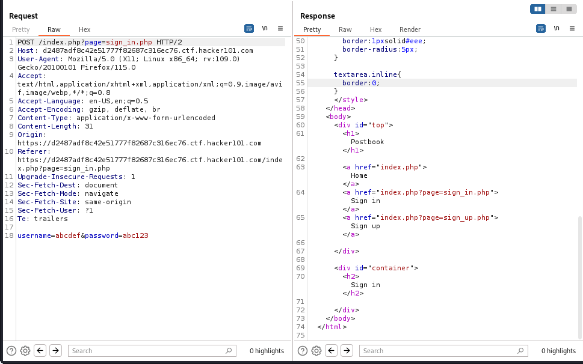
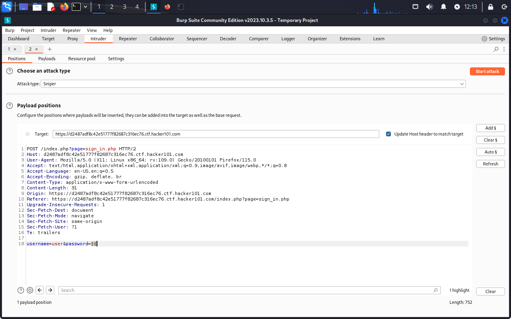
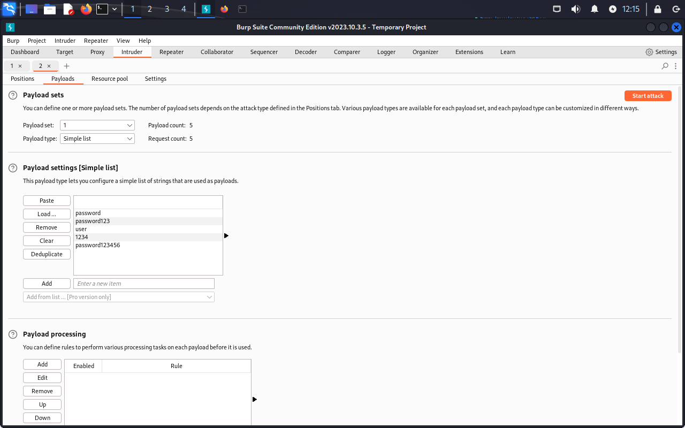
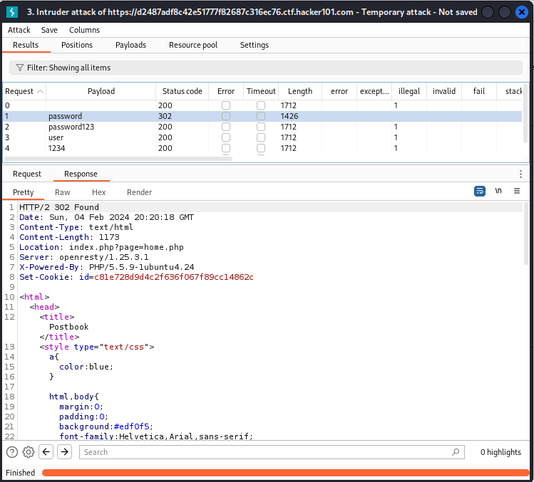
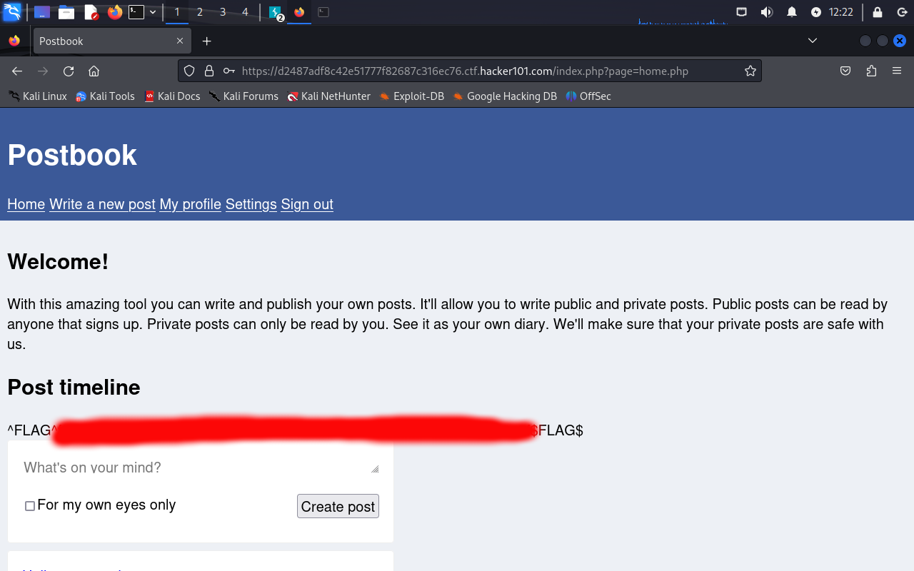

# Flag 1:
For the first challenge, I used the hint that the user with the username "user" had a password that was easy to crack. I knew that when I signed in, an HTTP POST request is made to /index.php?page=sign\_in.php. This request contains a username field and a password field. 

So, using the BurpSuite Intruder tool, I created a brief wordlist of common passwords. 
I ran this attack, and the only page that did not contain an error message when returned, and returned a "302 Found" response was the one where the password was "password". Going to the browser, and using the username "user" and password "password", allows us to sign in, and generate the correct cookie for accessing the homepage. The homepage contains the flag. 

### The Attack Setup & Wordlist

### Results of the Wordlist Attack

### Flag Result from Signin

