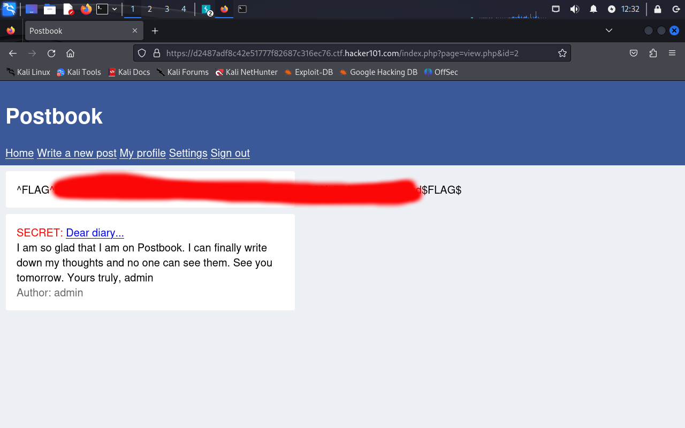

# Flag 2:
In order to find the second flag, I realized that I could create a post, and later view the post in my profile. When I did this, I realized that the url followed the schema "/index.php?page=view.php&id=\<i\>". I realized that I could put in different values for \<i\>, and navigate to different user posts. I eventually navigated to id=2, where I saw the post containing this key:

