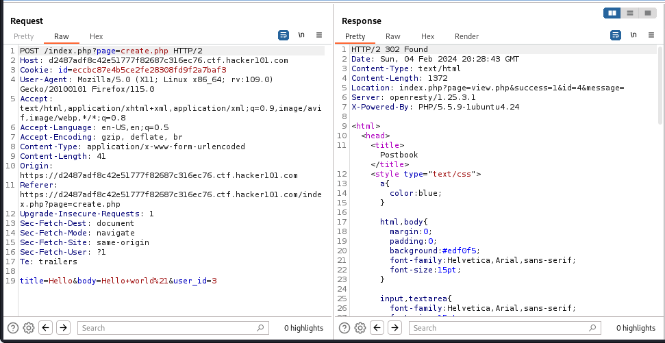
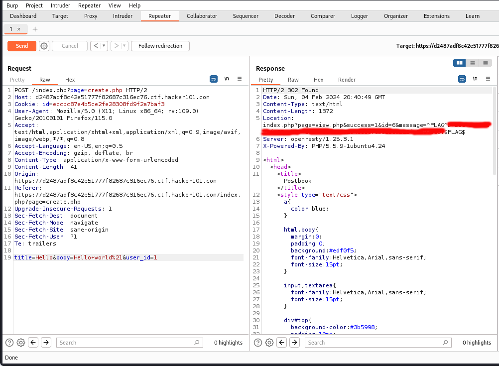
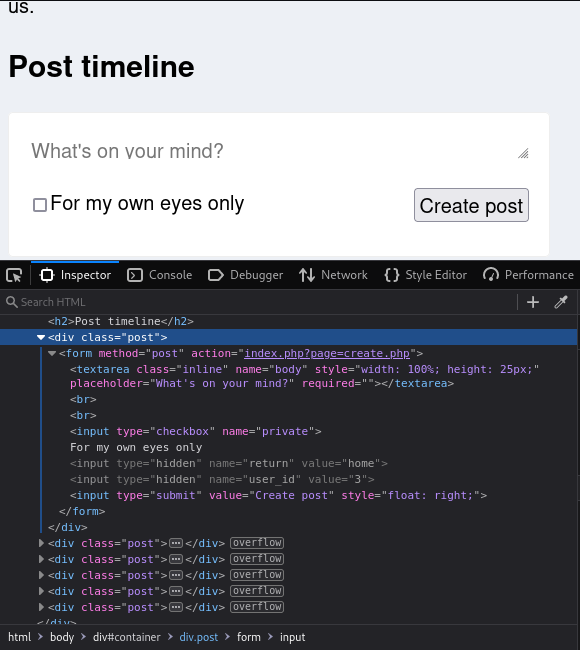
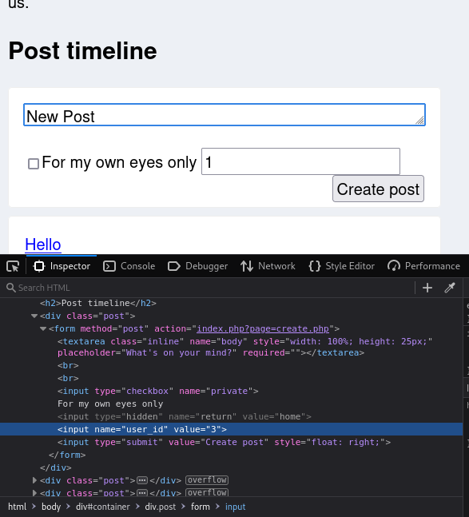

# Flag 3:
In order to find the third flag, I realized that for creating a new post as a user, an HTTP POST request is made to "/index.php?page=create.php", with the ability to specify the title, body, and user\_id in the body. So, taking a POST request, and repeating it with a different id allowed me to create a post as another user. This triggered GET request, the response of which contains the flag in the message parameter.

### Default Create POST Request

### Altered Request and Response (user\_id changed from "3" to "1")

 

Additionally, the user\_id can be specified in the form input to create a new post on the home.php page. The user\_id is a hidden input, which can be found by disabling the "hidden" status in the HTML. Setting this to another user will also enable the same POST request as discussed above, and redirect to a page displaying the flag.

### HTML for the Input Form

 

### HTML for the Input Form with Hidden Fields Revealed

