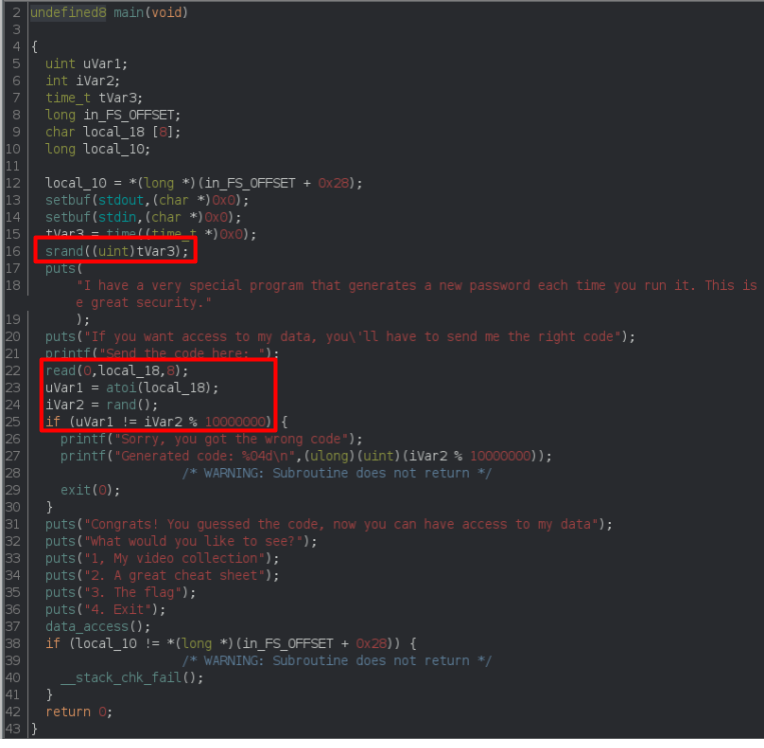
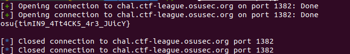

# guess-the-code Writeup

For this problem, we had to determine the correct random number between 0 and 9999999 that would be generated by the server, and guess that value. Fortunately, in the source code it was clear that the random number generator would be seeded the instant the program started, as seen in the image below. As the seed determines the order of the "random" numbers, then knowing the seed at the instant the program begins would allow the correct value to be known. 

There are several ways to accomplish this. One is to create a process that is called the minute a server connection is established in *pwntools*. A simpler way is to simply connect to the server twice. One host sends a false value, which then causes the program to leak the correct answer. The other host, having joined at the same time, will have the same seed, and the same answer. So, the answer leaked from the first host can be entered into the second host, allowing the hacker to access the flag. 

This was done using the following solve script:

[Solve Script](guess-the-codeSolveScript.py)

    from pwn import *

    #Start connections
    a = remote("chal.ctf-league.osusec.org", "1382")
    b = remote("chal.ctf-league.osusec.org", "1382")

    #Go through inputs, send fake guess ("1"), and receive value
    a.recvline()
    a.recvline()
    a.recv()
    a.sendline(b"1")
    c = a.recvline()

    #Ignore the first 45 characters, and only take the number that is returned
    payload = c.decode("utf-8")[44:]

    #Go through b, send the value found above from a, send, skip through prompts, and take option 3
    b.recvline()
    b.recvline()
    b.recv()
    b.sendline(payload.encode("utf-8"))

    for _ in range(6):
        b.recvline()

    b.sendline(b"3")

    #Get the flag output, print, and close connections
    c = b.recvline()

    print(c.decode("utf-8"))

    a.close()
    b.close()

This outputs the flag. 

Overall, a simple challenge, with a lot of flexibility in terms of solutions. 

